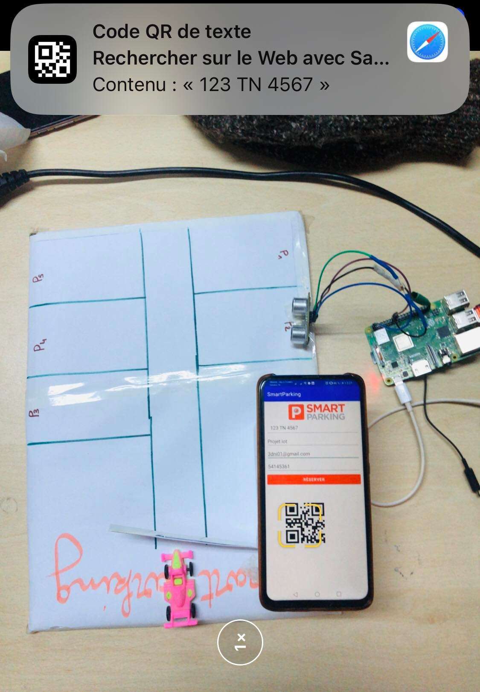

# Smart-Parking
## Description
Notre solution SMART QR BASED PARKING SYSTEM serait principalement axé sur l'aide au conducteur pour trouver facilement des places de stationnement
vacantes à l'aide du système de stationnement intelligent basé sur le code QR et pour réduire le trafic, la consommation d'énergie et la pollution de l'air.
## lien
[lien demo](https://drive.google.com/file/d/16TJafhZrxJOkgN_jrQ4Putlv6f54PFx-/view?usp=sharing)
# matrielle utlise:
* carte Raspberry
* capteur ultrason 
_ cablage 

 
 
 
Le projet est principalement divisé en deux parties 


# Partie 1 
** Appliction Mobile "Park it".
Application mobile qui genere un code QR a partir de donnée entrée pour reservé une place dans un parking.

* logiciel utilise:
_Android studio 


# Partie 2: 
** dashboard:
notre dashboard permet de gere les places reserve ou non
les outile :
- python 
- flask 
- html 


### Installing with pip
*  Pour installer flask vous pouvez utiliser la commande  :
```bash
 pip  install flask
```


