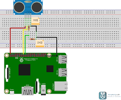
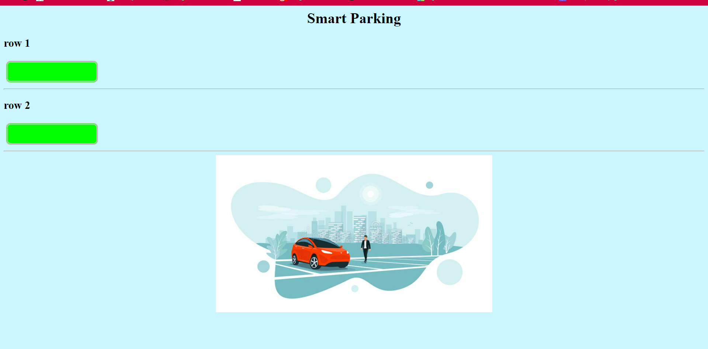

# Smart-Parking
## Description
Notre solution SMART QR BASED PARKING SYSTEM serait principalement axé sur l'aide au conducteur pour trouver facilement des places de stationnement
vacantes à l'aide du système de stationnement intelligent basé sur le code QR et pour réduire le trafic, la consommation d'énergie et la pollution de l'air.

# matrielle utlise:
* carte Raspberry
* capteur ultrason 
_ cablage 

 
Le projet est principalement divisé en deux parties 


# Partie 1 
** Appliction Mobile "Park it".
notre application permet l'authentification a traver QR code d'utilisateur pour acced a notre parking.
* logiciel utilise:
_Android studio 


# Partie 2: 
** dashbord 





### Installing with pip
*  Pour installer flask vous pouvez utiliser la commande  :
```bash
 pip  install flask
```


